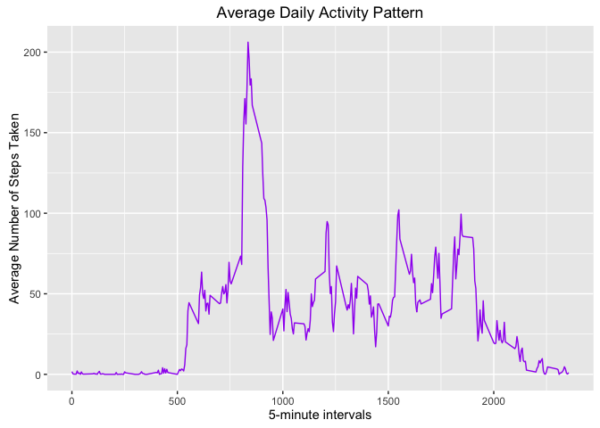
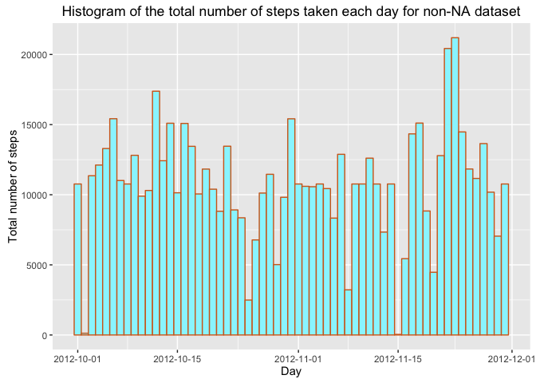

# Peer-graded Assignment: Course Project 1
Moh A  
02/12/2016  


## Loading and preprocessing the data


```r
library(lubridate)
library(ggplot2)
library(scales)

unzip("activity.zip")
dt <-
    read.csv("activity.csv", colClasses = c("integer", "Date", "factor"))
clean_dt <- na.omit(dt)
rownames(clean_dt) <- 1:nrow(clean_dt)
```


## What is mean total number of steps taken per day?

### 1. Make a histogram of the total number of steps taken each day


```r
sum_steps <-
    aggregate(clean_dt$steps, list(clean_dt$date), FUN = 'sum')

ggplot(sum_steps, aes(x = sum_steps$Group.1)) + geom_histogram(
    aes(weight = sum_steps$x),
    bins = 61,
    col = 'red',
    fill = 'green',
    alpha = '0.5'
) + scale_x_date(labels = date_format("%Y-%m-%d")) + labs(title = "Histogram of the total number of steps taken each day") + labs(x = "Day", y = "Total number of steps") 
```

<!-- -->


### 2. Calculate and report the mean and median total number of steps taken per day

 * Mean: 


```r
mean(sum_steps$x)
```

```
## [1] 10766.19
```


 - Median:


```r
median(sum_steps$x)
```

```
## [1] 10765
```

## What is the average daily activity pattern?

### 1. Make a histogram of the total number of steps taken each day


```r
avg_steps <-
    aggregate(clean_dt$steps, list(interval = as.numeric(as.character(clean_dt$interval))), FUN = 'mean')

ggplot(avg_steps, aes(interval, x)) + geom_line(color = "purple", size = 0.5) + labs(title = "Average Daily Activity Pattern", x = "5-minute intervals", y = "Average Number of Steps Taken")
```

<!-- -->


### 2. Which 5-minute interval, on average across all the days in the dataset, contains the maximum number of steps?


```r
avg_steps[which.max(avg_steps$x),]
```

```
##     interval        x
## 104      835 206.1698
```


## Imputing missing values

### 1. Calculate and report the total number of missing values in the dataset (i.e. the total number of rows with NAs)


```r
sapply(dt, function(y) sum(length(which(is.na(y)))))
```

```
##    steps     date interval 
##     2304        0        0
```


### 2. Devise a strategy for filling in all of the missing values in the dataset. The strategy does not need to be sophisticated. 


 * I will use the means for the 5-minute intervals to substitute for missing values.
    + First, locate the NA indices to determine their respective 5-minute interval.
    + Second, using the '5-minute interval' value, the mean of steps for that interval can be determined.
    + Substitute the mean value for the missing NA value.
    

### 3. Create a new dataset that is equal to the original dataset but with the missing data filled in.


```r
corrected_dt <- dt
for (i in 1:nrow(dt)) {
    if (is.na(corrected_dt$steps[i])) {
        corrected_dt$steps[i] <-
            avg_steps[which(corrected_dt$interval[i] == avg_steps$interval),]$x
    }
}
```


### 4. Make a histogram of the total number of steps taken each day and Calculate and report the mean and median total number of steps taken per day. Do these values differ from the estimates from the first part of the assignment? What is the impact of imputing missing data on the estimates of the total daily number of steps?


#### Histogram of the total number of steps taken each day for non-NA dataset


```r
sum_corrected_dt <- aggregate(corrected_dt$steps, list(corrected_dt$date), FUN = 'sum')

ggplot(sum_corrected_dt, aes(x = sum_corrected_dt$Group.1)) + geom_histogram(
    aes(weight = sum_corrected_dt$x),
    bins = 61,
    col = 'chocolate',
    fill = 'cadetblue1'
    ) + scale_x_date(labels = date_format("%Y-%m-%d")) + labs(title = "Histogram of the total number of steps taken each day for non-NA dataset") + labs(x = "Day", y = "Total number of steps")
```

<!-- -->

#### Calculate and report the mean and median total number of steps taken per day.

 * Mean for non-NA dataset: 


```r
mean(sum_corrected_dt$x)
```

```
## [1] 10766.19
```


 - Median for non-NA dataset:


```r
median(sum_corrected_dt$x)
```

```
## [1] 10766.19
```


#### Do these values differ from the estimates from the first part of the assignment?

* Difference between imputed data Mean and missing value mean


```r
mean(sum_corrected_dt$x) - mean(sum_steps$x)
```

```
## [1] 0
```


* Difference between imputed data Median and missing value mean


```r
median(sum_corrected_dt$x) - median(sum_steps$x)
```

```
## [1] 1.188679
```
 
#### What is the impact of imputing missing data on the estimates of the total daily number of steps?


• After imputing the missing data, the mean remains the same. However the median of the imputed data is greater than that of missing data.


## Are there differences in activity patterns between weekdays and weekends?


### 1. Create a new factor variable in the dataset with two levels – “weekday” and “weekend” indicating whether a given date is a weekday or weekend day.


```r
corrected_dt$weekdays <- factor(format(corrected_dt$date, "%a"))
levels(corrected_dt$weekdays) <- list( weekday = c('Mon', 'Tue', 'Wed', 'Thu', 'Fri'), 
                                  weekend = c('Sat', 'Sun'))
summary(corrected_dt$weekdays)
```

```
## weekday weekend 
##   12960    4608
```


### 2. Make a panel plot containing a time series plot (i.e. type = "l") of the 5-minute interval (x-axis) and the average number of steps taken, averaged across all weekday days or weekend days (y-axis).


```r
weekdays_avg_steps <- aggregate(corrected_dt$steps, list(weekdays = corrected_dt$weekdays, interval = as.numeric(as.character(corrected_dt$interval))), FUN = 'mean' )
ggplot(weekdays_avg_steps, aes(interval, x)) + facet_grid(weekdays ~.)+ geom_line( aes(x = interval, y= x, color = weekdays) ,lwd = 0.8 ) + labs(title = "Plot of the 5-minute interval vs average number of steps in 'Weekdays' and 'Weekends'") + labs(x = "Interval", y = "Average number of steps") 
```

<!-- -->
